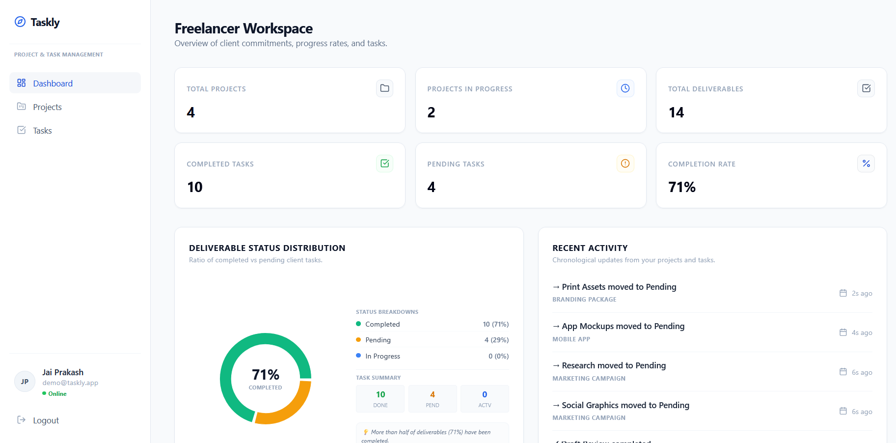
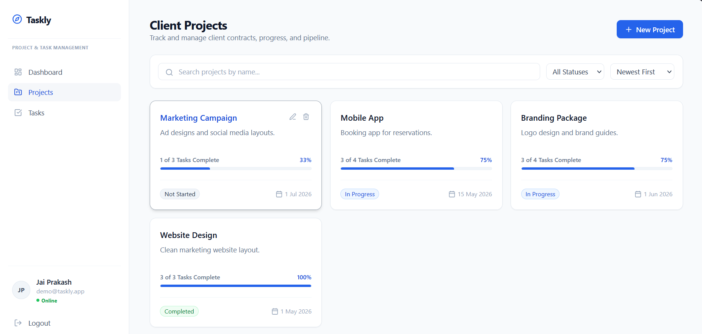
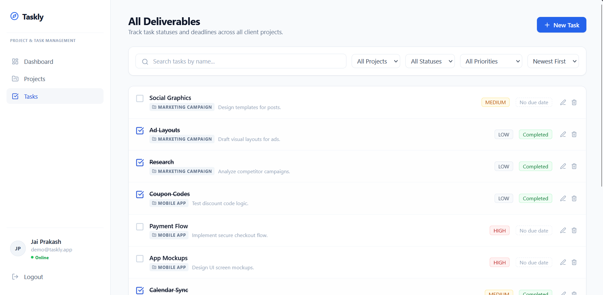
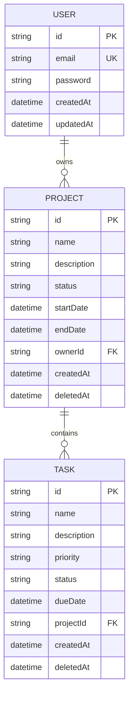

# Taskly

Taskly is a project operating system built for independent freelancers who manage multiple client engagements simultaneously. Unlike generic task managers, Taskly focuses on project ownership, deliverable tracking, deadline visibility, and secure client-work isolation through owner-scoped authorization.

The platform demonstrates modern full-stack engineering practices including secure authentication, relational data modeling, optimistic UI updates, API protection, and production-oriented deployment workflows.

## Live Demo

- Frontend: https://taskly-app-demo.vercel.app (Placeholder)
- Backend: https://taskly-api-demo.render.com (Placeholder)
- Demo Account: `demo@taskly.app` (one-click login, no typing required)

## Screenshots

### Dashboard
Summary view of ongoing client work, completion ratios, and recent activity.


### Projects
Freelancer-focused view of active client projects, pipeline status, and contracts.


### Tasks
Deliverables list with urgency badges (Overdue, Due Today, Completed).


## Table of Contents

- [Features](#features)
- [Architecture](#architecture)
- [Database Design](#database-design)
- [Engineering Decisions](#engineering-decisions)
- [Security Measures](#security-measures)
- [Performance Optimizations](#performance-optimizations)
- [API Documentation](#api-documentation)
- [Repository Structure](#repository-structure)
- [Installation](#installation)
- [Environment Variables](#environment-variables)
- [Product Roadmap](#product-roadmap)

## Features

- **Authentication**: JWT-based authorization with bcrypt password hashing. Login attempts are rate-limited (10/15m) and registration attempts are rate-limited (5/15m) to prevent brute force attacks. Passwords must contain 8+ characters, uppercase, lowercase, and a number.
- **Project Management**: Full owner-scoped CRUD. Projects cannot be accessed or modified by any user other than their owner.
- **Task Management**: Tasks belong to projects, with inline status toggles and priority/due date tracking.
- **Dashboard Analytics**: Computes project and task completion percentages and surfaces the five most recent tasks via a single aggregated endpoint.
- **Search & Filtering**: Case-insensitive name search. Filter projects by status; filter tasks by status, priority, and project.
- **Pagination & Sorting**: Ten items per page with metadata. Sort projects by newest, oldest, or name; sort tasks by due date, priority, or newest.
- **Optimistic UI**: Status toggles update instantly via TanStack Query cache writes, with automatic rollback on request failure.
- **Soft Delete**: Deletes are recorded with a `deletedAt` timestamp rather than removing rows, preserving historical client data while hiding it from active views.
- **Demo Mode**: A single click logs into a pre-seeded freelancer profile, removing friction for reviewers and recruiters.

## Architecture

```
┌────────────────────────────────────────────────────────────────────────┐
│                             CLIENT (Vite)                              │
│  React Hooks ──► AuthContext ──► Axios Client ──► TanStack Query Cache │
└───────────────────────────────────┬────────────────────────────────────┘
                                     │ HTTP / HTTPS (JSON)
┌───────────────────────────────────▼────────────────────────────────────┐
│                             API (Node.js)                              │
│  Express Server ──► Security Middleware ──► Controller Actions         │
└───────────────────────────────────┬────────────────────────────────────┘
                                     │ Prisma Client
┌───────────────────────────────────▼────────────────────────────────────┐
│                           DATABASE (Neon)                              │
│  PostgreSQL (Indexed columns: ownerId, status, priority, dueDate)      │
└────────────────────────────────────────────────────────────────────────┘
```

### Frontend Architecture

- **State Management**: React Context (`AuthContext.tsx`) manages session state. TanStack Query serves as the server-state cache, handling synchronization, background refetching, and optimistic mutations.
- **Forms**: React Hook Form paired with Zod schemas validates input before any request is dispatched, minimizing unnecessary re-renders.

### Backend Architecture

- **Middleware stack**: `helmet` (security headers), `cors` (origin restriction), `express-rate-limit` (brute-force protection), `authenticateToken` (JWT verification), `validateBody` / `validateQuery` (Zod-based request validation).
- **Service layer**: Express controllers delegate persistence to Prisma ORM, keeping route handlers thin and testable.

## Database Design

Relational hierarchy with cascading deletes: `User (1) → (N) Project (1) → (N) Task`.



This diagram renders natively on GitHub. A static export is also available at `./docs/er-diagram.png` for environments that do not support Mermaid.

## Engineering Decisions

**Why PostgreSQL?**
Relational integrity is critical for enforcing ownership relationships between users, projects, and tasks. Foreign keys and cascading deletes keep the data model consistent without application-level cleanup logic.

**Why Prisma?**
Prisma provides type-safe database access, a structured migration workflow, and parameterized query generation that mitigates SQL injection risk by construction rather than convention.

**Why JWT Authentication?**
JSON Web Tokens enable stateless authentication that scales cleanly across distributed deployments, removing the need for server-side session storage.

**Why TanStack Query?**
TanStack Query handles server-state synchronization, caching, and optimistic UI updates declaratively, reducing the amount of manual state management code required on the client.

**Why Soft Deletes?**
Freelancers need an auditable history of client work even after a project is archived. A `deletedAt` timestamp preserves records for historical reporting while excluding them from active views.

## Security Measures

- Password hashing with bcrypt
- JWT-based authentication and route protection middleware
- Owner-scoped authorization on every project and task operation
- Rate limiting on authentication routes
- Request validation using Zod
- SQL injection protection via Prisma's parameterized queries
- Secure HTTP headers via Helmet
- CORS restricted to known origins

## Performance Optimizations

- Prisma client singleton to avoid exhausting database connections in development
- Database indexes on `ownerId`, `projectId`, `status`, `priority`, and `dueDate`
- TanStack Query caching to minimize redundant network requests
- Optimistic UI updates to remove perceived latency on common actions
- Route-level lazy loading on the frontend
- Parallelized dashboard aggregation queries using `Promise.all`
- Response compression middleware

## API Documentation

All responses use a standardized JSON envelope:

- Success: `{"success": true, "data": {...}}`
- Error: `{"success": false, "message": "..."}`
- Validation error: `{"success": false, "message": "Validation failed", "errors": [{"field": "...", "message": "..."}]}`

### Endpoints

| Method | Endpoint              | Description                              | Auth |
|--------|-----------------------|-------------------------------------------|------|
| POST   | /api/auth/register    | Register a new user                      | No   |
| POST   | /api/auth/login       | Authenticate and obtain a JWT             | No   |
| POST   | /api/auth/logout      | Invalidate the client session             | No   |
| GET    | /api/projects         | List projects (paged, filtered)           | Yes  |
| POST   | /api/projects         | Create a project                          | Yes  |
| GET    | /api/projects/:id     | Fetch a project                           | Yes  |
| PUT    | /api/projects/:id     | Update a project                          | Yes  |
| DELETE | /api/projects/:id     | Soft-delete a project and its tasks       | Yes  |
| GET    | /api/tasks            | List tasks (paged, filtered, sorted)      | Yes  |
| POST   | /api/tasks            | Create a task                             | Yes  |
| GET    | /api/tasks/:id        | Fetch a task                              | Yes  |
| PUT    | /api/tasks/:id        | Update a task or toggle completion        | Yes  |
| DELETE | /api/tasks/:id        | Soft-delete a task                        | Yes  |
| GET    | /api/dashboard        | Aggregated dashboard stats and recents    | Yes  |

### Request and Response Examples

**Register User** — `POST /api/auth/register`

Request:
```json
{
  "email": "freelancer@taskly.app",
  "password": "TasklyPassword@2026"
}
```

Response (201 Created):
```json
{
  "success": true,
  "data": {
    "token": "eyJhbGciOiJIUzI1NiIsInR5cCI6IkpXVCJ9...",
    "user": {
      "id": "e22a45b6-7b2c-491d-aa89-56fd62d98c11",
      "email": "freelancer@taskly.app"
    }
  }
}
```

**Fetch Dashboard Stats** — `GET /api/dashboard`

Response (200 OK):
```json
{
  "success": true,
  "data": {
    "totalProjects": 3,
    "projectsInProgress": 1,
    "totalTasks": 14,
    "completedTasks": 5,
    "pendingTasks": 7,
    "inProgressTasks": 2,
    "completionPercentage": 36,
    "recentTasks": [
      {
        "id": "c3a60897-746e-482b-8a80-9a35d3fcc009",
        "name": "Design Logo vectors",
        "priority": "HIGH",
        "status": "IN_PROGRESS",
        "dueDate": "2026-06-18T00:00:00.000Z",
        "projectId": "b90688e9-9bd6-4540-ab8b-8c640e7030e2",
        "project": { "name": "Acme Corp Branding" }
      }
    ]
  }
}
```

## Repository Structure

```
taskly/
├── backend/
│   ├── src/
│   ├── prisma/
│   └── .gitignore
├── frontend/
│   ├── src/
│   └── .gitignore
├── docs/
│   └── er-diagram.png
├── docker-compose.yml
├── .gitignore
└── README.md
```

## Installation

### Prerequisites

- Node.js v18 or higher
- npm v9 or higher
- Docker Desktop (optional, for containerized setup)

### Setup

1. Clone the repository:
   ```
   git clone https://github.com/your-username/taskly.git
   cd taskly
   ```

2. Install dependencies:
   ```
   npm install
   cd backend && npm install
   cd ../frontend && npm install
   cd ..
   ```

3. Configure environment variables. Create `.env` at the project root and inside `backend/`:
   ```
   DATABASE_URL="your_postgres_connection_string"
   PORT=5000
   JWT_SECRET="your_jwt_secret_key"
   NODE_ENV="development"
   ```

4. Run migrations and seed the database:
   ```
   npx prisma migrate dev --schema=prisma/schema.prisma
   npx prisma db seed --schema=prisma/schema.prisma
   ```

5. Run locally:
   - Backend: `cd backend && npm run dev`
   - Frontend: `cd frontend && npm run dev`
   - Open `http://localhost:5173` and select "View Demo Workspace" to log in instantly.

### Running with Docker

```
docker compose up --build
```

The application will be available at `http://localhost:5173` (frontend) and `http://localhost:5000` (backend).

## Environment Variables

### Backend

| Variable       | Description                                          |
|----------------|-------------------------------------------------------|
| `DATABASE_URL` | Connection string for the PostgreSQL instance (Neon)  |
| `PORT`         | Network port for the Express server (default 5000)    |
| `JWT_SECRET`   | Secret key used to sign and verify JWTs                |
| `NODE_ENV`     | Runtime mode: `development` or `production`            |

### Frontend

| Variable       | Description                                            |
|----------------|----------------------------------------------------------|
| `VITE_API_URL` | Base path for backend endpoints (default `http://localhost:5000/api`) |

## Product Roadmap

- Team collaboration on shared projects
- Activity audit trail for project and task changes
- Kanban-style workflow board with drag-and-drop
- Calendar integrations for deadline visibility
- Client portal access for external stakeholders
- File attachments on tasks and projects
- Time tracking per task
- Invoice generation from completed deliverables
